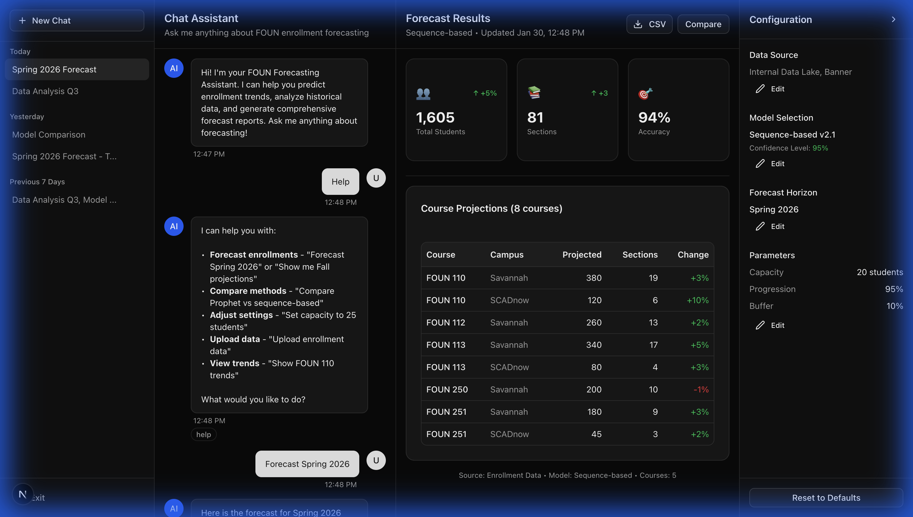

# Forecast Tool Walkthrough

## Demo Recording


---

## What the Demo Shows

1. **Help Command** → Lists available commands
2. **Forecast Spring 2026** → Populates results panel with:
   - 1,605 total students
   - 81 sections
   - 94% accuracy
   - 8 course projections table
3. **Show Settings** → Displays current configuration

---

## Final State



---

## Run Commands

```bash
# Terminal 1 - Frontend
cd frontend && npm run dev

# Terminal 2 - Backend  
./.venv/bin/uvicorn api.main:app --port 8000
```

- Frontend: http://localhost:3000
- API Docs: http://localhost:8000/docs
